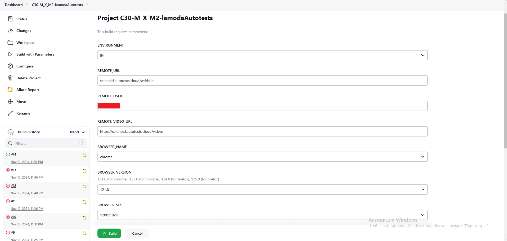
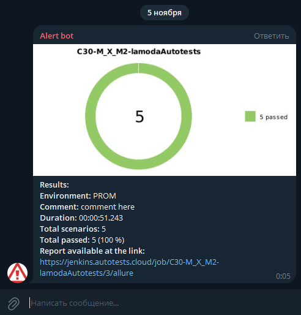

# Автотесты для сайта [lamoda](https://www.lamoda.ru/).

## Содержание

* <a href="#tests">Описание проверок</a>
* <a href="#tools">Технологии</a>
* <a href="#jenkins">Запуск тестов</a>
* <a href="#allure">Отчет в Allure</a>
* <a href="#telegramBot">Бот в Telegram</a>
* <a href="#video">Видео прохождения тестов</a>

---

## <a name="Описание проверок">**Описание проверок**</a>

Представленные смок тесты проверяют:
1) Т001 - Проверка поиска товара (кольцо Sokolov) по артикулу.
2) Т002 - Проверка поиска мяча Demix через ключевое слово "мяч" в поиске.
3) Т003 - Проверка работы корзины. Добавление товара (кольцо Sokolov) в корзину, удаление товара из корзины.
4) Т004 - Проверка работы фильтров Материала (полиэстер), Цвета (мультиколор), Размера (7), Бренда (GSD), Страны производства (Китай), при поиске по ключевому слову "мяч".
5) Т005 - Проверка сортировки товара по цене, по возрастанию, при поиске по ключевому слову "плед".

---

## <a name="Технологии:">**Технологии:**</a>

1) Проект автотестов написан с использованием Java
2) Проверки реализованы при помощи JUnit5
3) В качестве сборщика проектов используется Gradle
4) Для работы с элементами вебстраниц используется Selenide
5) Результаты автотестов преобразуются в Allure-отчет
6) Для выполнения автотестов с различными входными параметрами используется Jenkins
7) Полученный Allure-отчет выгружается в чат telegram при помощи бота

  
   
  
  
  
 
  
 

---

## <a name="Запуск тестов">**Запуск тестов**</a>

Присутствует возможность локального и удаленного запуска тестов.

Для удаленного запуска используется [Jenkins](https://jenkins.autotests.cloud/job/C30-M_X_M2-lamodaAutotests/)  

В качестве переменных параметров используются:
1) Стенд (IFT, PSI, LT, PROM)
2) Браузер (Chrome/Firefox)
3) Версия браузера (Для Chrome: 121, 122, для Firefox: 124, 125)
4) Разрешения браузера: 1280х1024 и 1920х1080

Для локального запуска достаточно запустить тесты из IDE или из командной строки bash при помощи команды **gradle test**

При локальном запуске используется Chrome с разрешеним 1920x1080.

---

## <a name="Отчет в Allure">**Отчет в Allure**</a>

После выполнения тестов имеется возможность ознакомиться с отчетом в [Allure](https://jenkins.autotests.cloud/job/C30-M_X_M2-lamodaAutotests/allure)
### На скриншоте представлен пример результата выполнения тестов:

---

## <a name="Бот в Telegram">**Бот в Telegram**</a>

После выполнения тестов, бот в Telegram присылает краткий отчет о результатах тестирования:

    

---

<h1>Пример прохождения тестов</h1>
   
